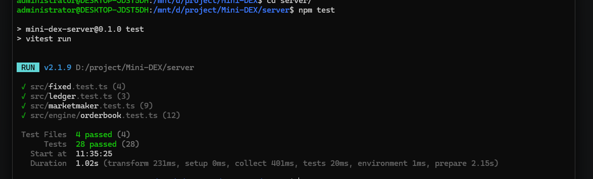
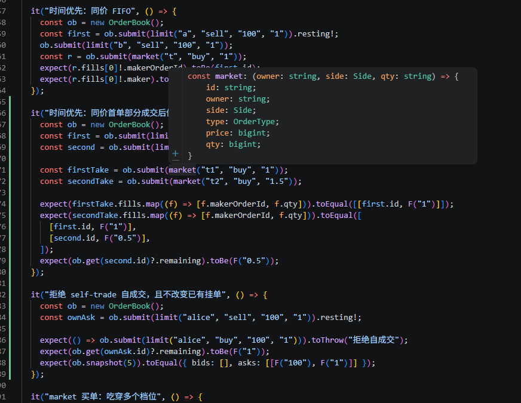
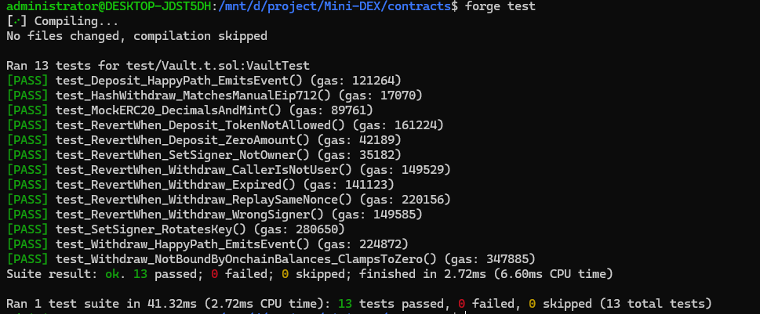
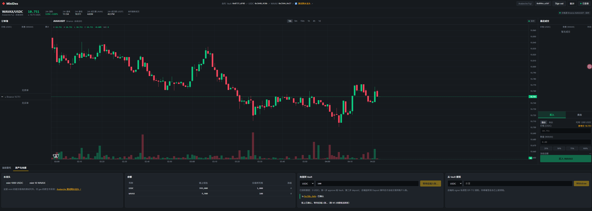
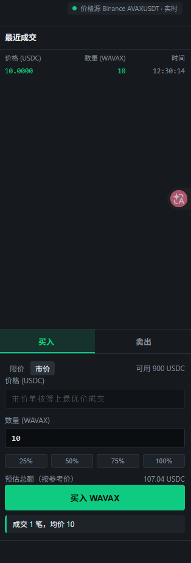

1.npm test 全部通过：

补充时间优先和拒绝自成交测试：

2.合约部署到fuji网络：
forge test 全部通过：

[广播记录](run-latest.json)
部署地址：
VAULT_ADDRESS=0x0737d880D70A21a9f58d3008a51C37CEd7F16F05
USDC_ADDRESS=0x3648b756D2a25E5fB371b5E182B7cf7616679C0b
WAVAX_ADDRESS=0xC9A4f4061d89f8FD1F1Fc8625a8541f115049eE7
deposite交易哈希：0xc50b5859e6560c85a38068de68ddb7c6fb14aa6329263606dbdc5ef71e3b6efe
3.端到端演示：
登录成功和余额展示：

withdraw交易哈希：0x4e3e15260599c819bb786c9da96a242770bf3f5199d67c32f8cab5b6fab076cb
两个地址完成成交：
