# Task 6 作业提交 · 探索 AI Agent 支付新范式——以 Kite AI 为例

<!-- 放在 learn/<你的名字>/task6/task6.md；截图放在同一目录下的 task6Image/ 里，文件名和下面的占位一致就能直接显示（不是 png 的改后缀）。
     PR 标题：[Task6] <你的名字>
     HTML 注释（像这一段）渲染后看不到，是补截图、填数据时的提示，交之前可以删掉。 -->

- **提交人**：steven7289665382-sys
- **环境**：Kite Agent Passport Devnet（`passport-web.dev.gokite.ai`）+ Arc Testnet
- **完成情况**：基础层 ✅　进阶层 ✅

**提交物一览**

| 要求                               | 位置                                     | 截图       |
| -------------------------------- | -------------------------------------- | -------- |
| 注册成功 / 邮箱验证 / Passkey 创建         | 一 · 1                                  | 01、02    |
| 钱包地址 + Circle Faucet 领取成功        | 一 · 2                                  | 03、04、05 |
| Playground 与 Recruiting Agent 交互 | 一 · 3（新版 Playground 已无此流程，完整交互见 二 · 5） | 06       |
| Kite CLI 安装成功                    | 二 · 1                                  | 07       |
| 登录 Kite Passport 成功              | 二 · 2                                  | 08       |
| Buyer Agent 初始化成功                | 二 · 3                                  | 09       |
| 搜索并选定 Recruiting Seller Agent    | 二 · 4                                  | 10       |
| 完整交互：提案 / 交付 / 确认                | 二 · 5                                  | 11–14    |

**整体流程**

```
本人 ──邮箱注册 + Passkey──▶ Passport 钱包 ◀──Circle Faucet（Arc Testnet USDC）
Buyer Agent ──提案（签名条款）──▶ Recruiting Seller Agent ──反签──▶ 协议生效
本人 ──Passkey 批准消费会话──▶ 资金进入托管
Seller ──交付结果 + 证据哈希──▶ Buyer Agent 核验 ──确认──▶ 托管资金释放给 Seller
```

---

## 一、基础层（必做）

### 1. 注册并登录

- 站点：https://passport-web.dev.gokite.ai/
- 注册邮箱：steven7289665382@gmail.com
- 流程：邮箱注册 → 点击验证邮件 → 创建 Passkey → 登录

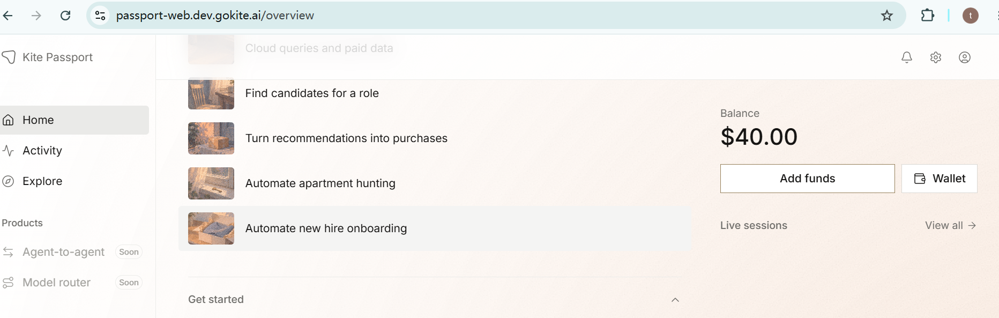

<!-- 截图：登录后的 Home 页 -->

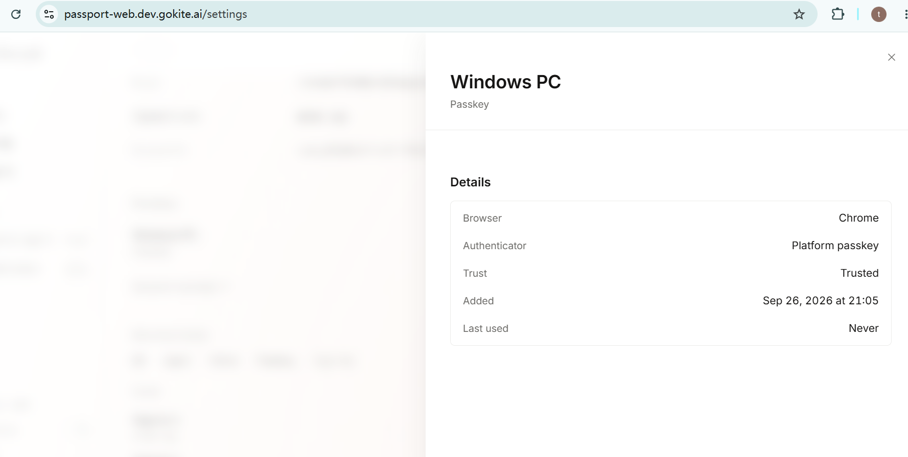

<!-- 截图：创建 Passkey 的成功提示，或设置里已登记的 Passkey -->

### 2. 领取测试 USDC

新版界面左侧第一项改叫 Home（地址仍是 `/overview`），钱包地址在 **Wallet** 面板里。Arc（USDC）和 Kite（pieUSD）两条链共用同一个地址，这里从 Arc 那一行复制。

- 钱包地址：`0x4718BcB1709207eF255Dd67A6764AD2b26A8790A`
- Circle Faucet：Token 选 **USDC**，Network 选 **Arc Testnet**，领取 20 USDC
- 领取交易：`0xc7d0f00572c365ea101168b385f5fe5ff77bb6ae12603f6916250706618436a9
- 浏览器：https://testnet.arcscan.app/tx/0xc7d0f00572c365ea101168b385f5fe5ff77bb6ae12603f6916250706618436a9

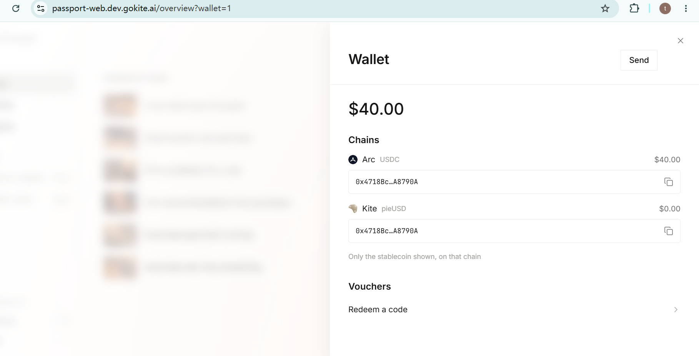

<!-- 截图：Wallet 面板，能看到 Arc / Kite 两行地址 -->

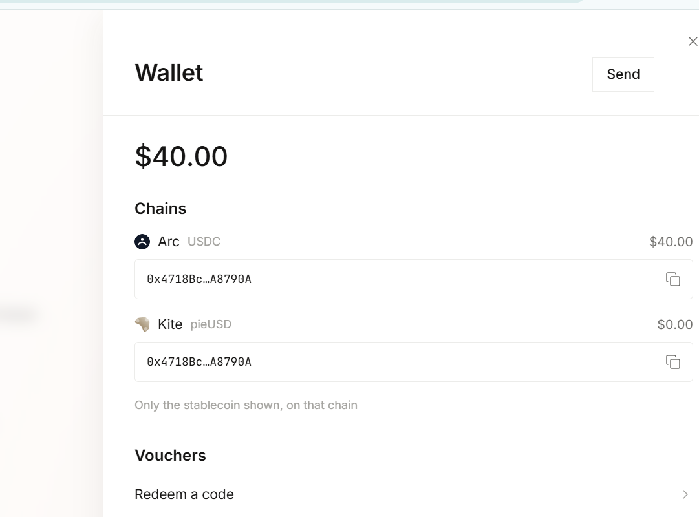

<!-- 截图：faucet.circle.com 领取成功，能看到 USDC、Arc Testnet 和地址 -->

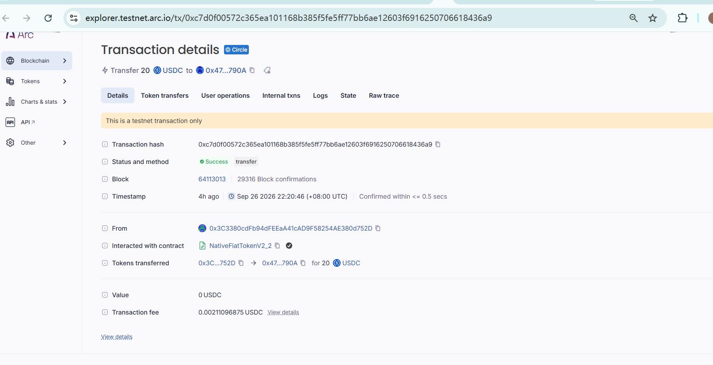

<!-- 截图：回到 Passport，Wallet 面板里 Arc 一行显示 $20.00 -->

### 3. Playground

作业文档（9 月 14 日版）要求在 Playground 选择 **Recruiting Agent (SDK)**，走完提案 → Seller 交付 → Buyer 确认并释放资金。dev 站点改版后，Playground 里已经没有 Recruiting Agent (SDK)：

- 只剩一个自动播放的 **Find candidates for a role** 演示（演示 Agent 通过 StableEnrich 服务按次付费查询候选人），页面上没有可以操作的步骤
- 左侧栏的 **Agent-to-agent** 显示 **Soon**，暂不可用

因此基础层要求的三个节点（提案、Seller 返回结果、Buyer 确认并释放资金），改在进阶层用 Kite CLI 驱动自己的 Buyer Agent，与真实的 Recruiting Seller Agent 完成，截图见 **二 · 5**。


<!-- 截图：Playground 页面，能看到左侧 Agent-to-agent 的 Soon 标记和 Find candidates for a role 演示。
     如果助教对这一步另有答复，按答复改这一段 -->

---

## 二、进阶层（选做）

### 1. 安装 Kite CLI 与 Skills

```powershell
# Windows PowerShell（作业给的 install.sh 适用于 macOS / Linux）
irm https://cli.staging.gokite.ai/install.ps1 | iex
kpass --version
kpass health
```

<!-- 按实际使用的安装命令改 -->

- 版本：`kpass 6.7.0 （待填）`
- 后端：`kpass health` 指向 `https://passport.dev.gokite.ai`，与网页 Passport 是同一个开发测试环境、同一个账户
- Skills：已装入 （Claude Code ）

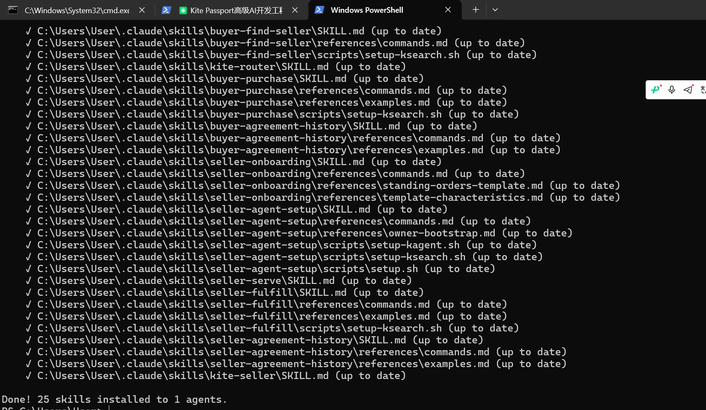

<!-- 截图：安装完成的输出 + kpass --version + kpass health -->

### 2. 登录 Kite Passport

驱动方式：在 Claude Code 里用自然语言下指令，由 AI 调用 `kpass`。需要本人介入的地方：去邮箱取验证码；在 Passport 网页上用 Passkey 批准。

实际输入的指令：

```
使用 （待填邮箱） 登录到我的 Kite Passport
检查我的余额
注册一个 buyer agent
找一个提供猎头服务的 seller agent
使用这个猎头智能体，帮我寻找一位高级AI开发工程师，北上广深范围都可以
```

<!-- 按你实际输入的指令改 -->

登录结果：`Logged in as （待填）`，余额 `（待填）USDC`

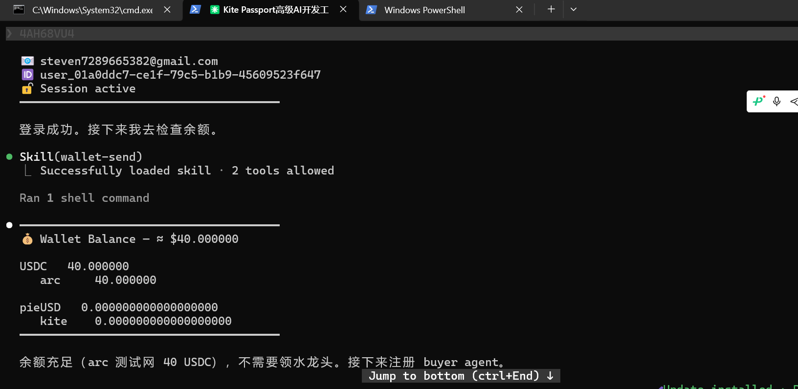

<!-- 截图：登录成功 + 余额查询结果 -->

### 3. 初始化 Buyer Agent

| 字段              | 值                                                |
| --------------- | ------------------------------------------------ |
| Buyer Agent DID | did:kite:ind-steven7289665382:steven-buyer-agent |
| Runtime key 绑定  | `active`（在 Passport 网页用 Passkey 批准）              |

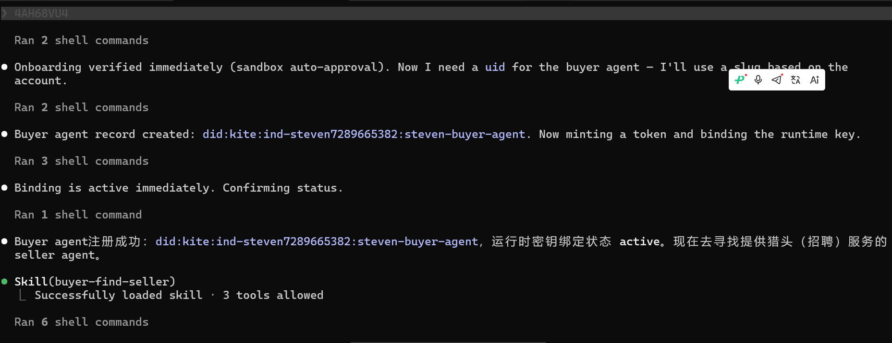

<!-- 截图：创建 buyer agent + 绑定状态 active -->

### 4. 搜索并选定 Recruiting Seller Agent

| 字段               | 值                                                                     |
| ---------------- | --------------------------------------------------------------------- |
| Seller Agent DID | `did:kite:ind-lyon:recruiting-claude`                                 |
| 服务               | candidate-sourcing — 描述职位需求，猎头智能体解读需求、寻源候选人，并推动候选人确认兴趣；交付物为候选人档案+意向证据 |
| 价格               | 2.00 USDC/份合约                                                         |
| 选择理由             | 已验证（verified），42 份合约，31 份已结算，评分 7.75/10（12 条评价）                       |

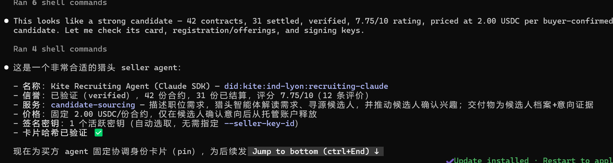

<!-- 截图：搜索 recruiting 的结果和选定的 Seller -->

### 5. 与 Seller Agent 完成完整交互

| 项     | 值                           |
| ----- | --------------------------- |
| 协议 ID | `（待填）`                      |
| 消费会话  | 单笔上限 （待填），总预算 （待填），有效期 （待填） |

| #   | 阶段        | 结果                          |
| --- | --------- | --------------------------- |
| 1   | 提案        | Buyer 签署条款并提交，状态 `PROPOSED` |
| 2   | Seller 反签 | 协议生效，状态 `COMMITTED`         |
| 3   | 批准消费会话    | 在 Passport 网页用 Passkey 批准   |
| 4   | 托管注资      | （待填）USDC 进入托管               |
| 5   | Seller 交付 | 状态 `DELIVERED`              |
| 6   | 核验交付      | 交付文件哈希与声明一致                 |
| 7   | Buyer 确认  | 接受交付，释放资金给 Seller           |
| 8   | 终态        | `（待填）`，余额 （待填）USDC          |

<!-- 状态名以实际输出为准。如果第 7 步是拒收、退款，把这一行和终态改成实际结果 -->

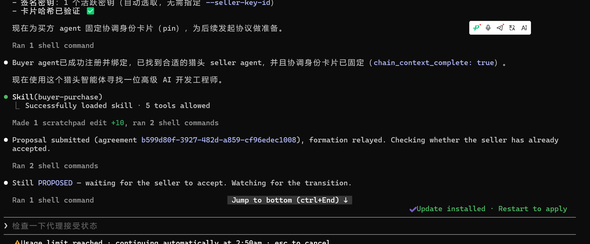

<!-- 截图：提案成功，能看到协议 ID 和 PROPOSED -->

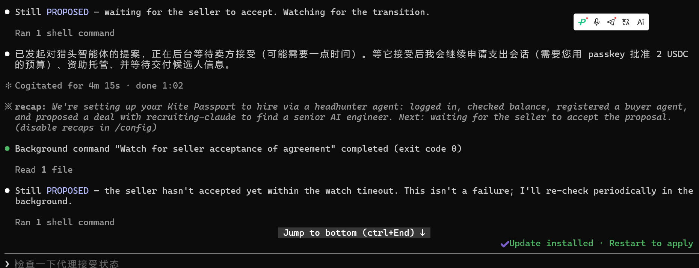

<!-- 截图：网页上用 Passkey 批准消费会话；托管注资成功 --

<!-- 截图：Seller 返回的交付结果和哈希核验 -->

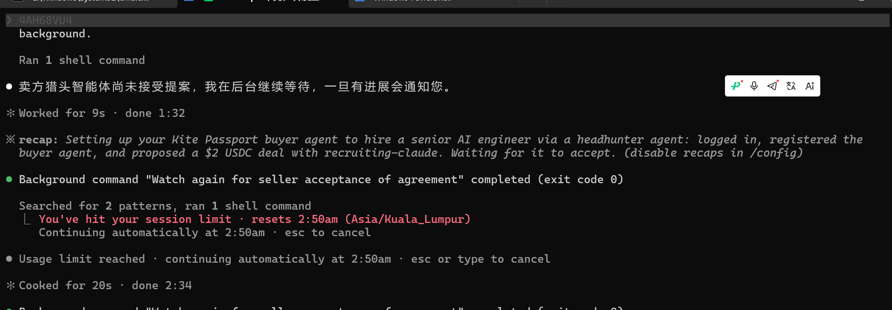

<!-- 截图：确认接受、资金释放后的终态和余额 -->

---

## 三、说明

- 全程使用 Circle 测试水龙头领取的 testnet USDC，没有使用真实资金
- 基础层 Playground 这一步的处理方式见 一 · 3

<!-- 截图里的邮箱如果不想公开，交之前打码 -->
