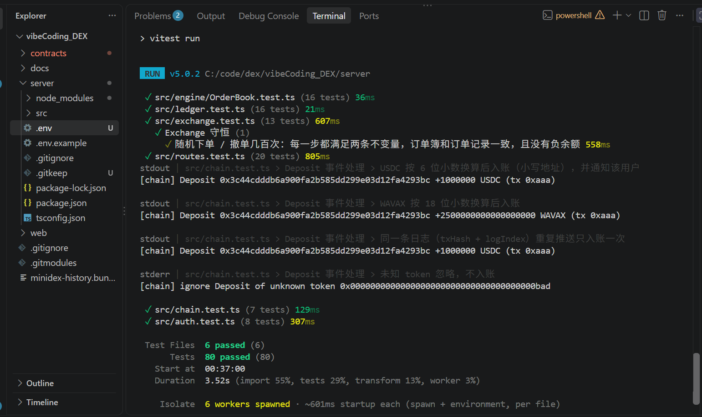
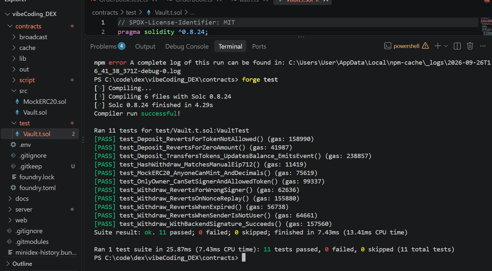
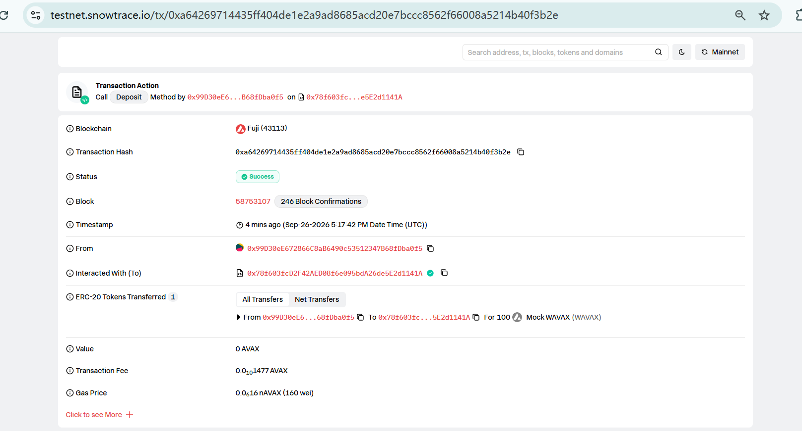
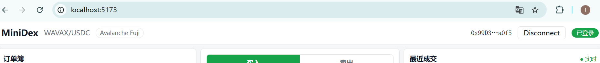
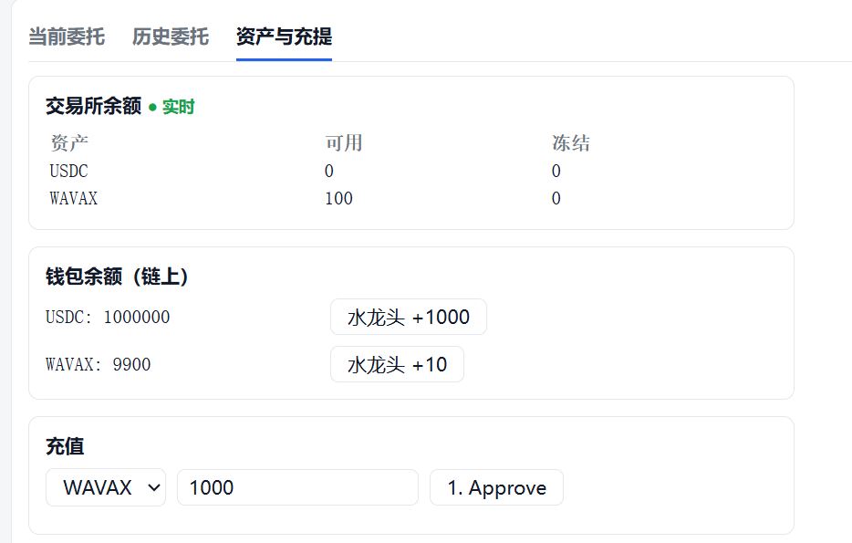
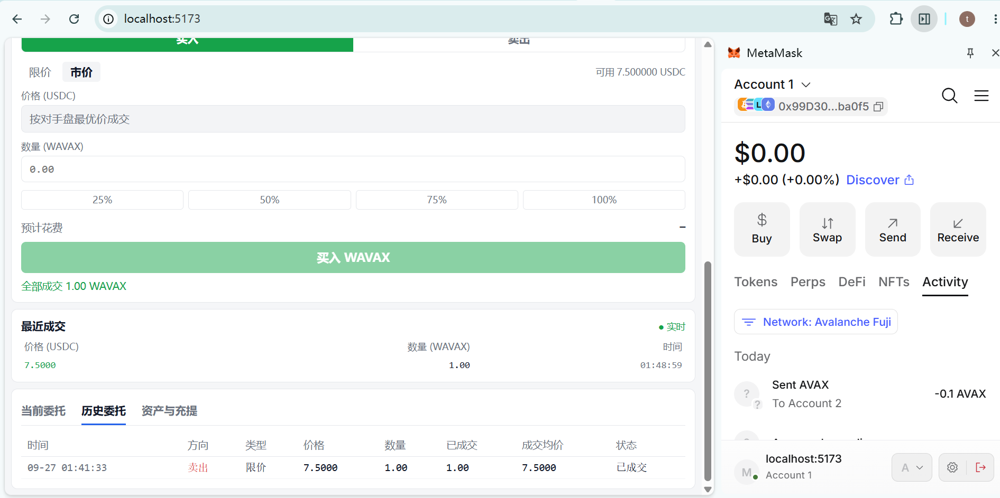
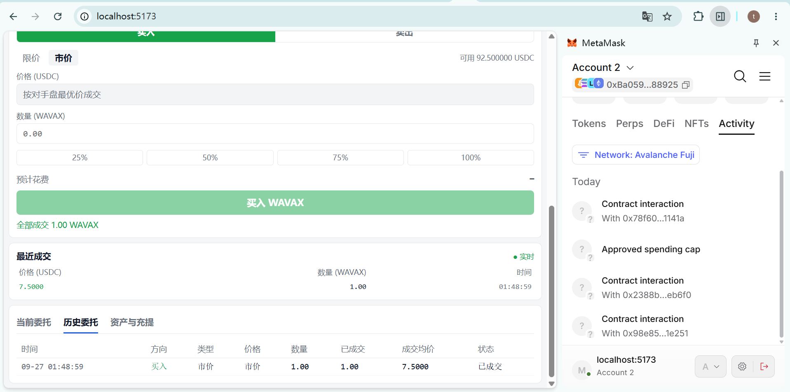
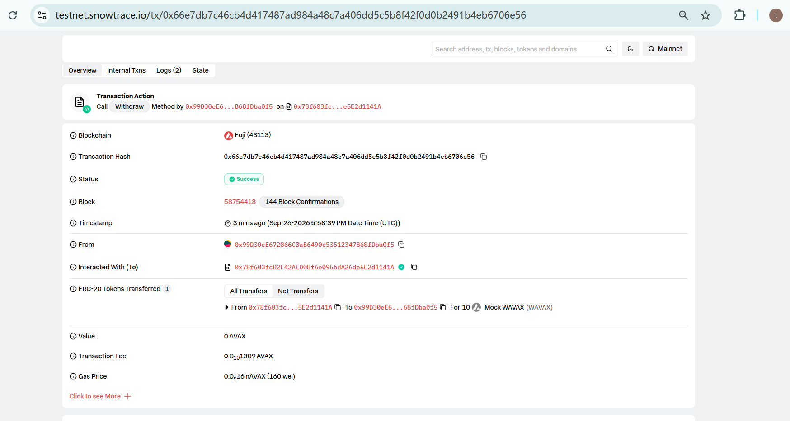

# Task 7 作业提交 · MiniDex

<!-- 建议放在仓库的 docs/task7.md；截图放在 docs/images/ 下，文件名和下面的占位一致就能直接显示。
     HTML 注释（像这一段）在渲染后看不到，是给自己补截图时看的提示，交之前可以删掉。 -->

- **项目**：MiniDex —— WAVAX/USDC 订单簿交易所。资金托管在 Avalanche Fuji 上的 Vault 合约里，撮合在链下完成
- **代码仓库**：（待填：仓库链接）
- **开发方式**：先写规格、测试先行，AI 辅助编码（规格见 `docs/06-trading-layer-spec.md`）

**提交物一览**

| 要求                          | 位置          |
| --------------------------- | ----------- |
| 代码仓库或提交记录                   | 下方「提交记录」    |
| npm test 与 forge test 全绿的证明 | 一 · 1、一 · 2 |
| 3 个 Fuji 合约地址               | 一 · 2       |
| deposit 和 withdraw 的交易哈希    | 一 · 2、一 · 3 |
| 登录、余额、两地址成交的截图              | 一 · 3       |
| 进阶功能的代码、测试或演示证明             | 二           |

**提交记录**

| 提交        | 内容                                                             |
| --------- | -------------------------------------------------------------- |
| `96a9600` | 基线：课程 prompt 00–04 完成态；`.env.example` 去掉真实私钥，补根目录 `.gitignore` |
| `81eef76` | 交易层规格（下单 / 撤单 / 订单簿 / 成交）                                      |
| `cbb2aec` | 账本冻结 / 解冻 / 扣冻结 + 成交额计算                                        |
| `01c0d97` | Exchange 交易服务（冻结 → 撮合 → 结算 → 撤单）                               |
| `1b102a7` | 下单 / 撤单 / 订单簿 / 成交接口 + WebSocket 行情广播                          |
| `4403ce4` | 前端交易界面（订单簿 / 下单 / 最近成交 / 委托）                                   |
| `94d232c` | 取证清单                                                           |

**整体结构**

```
钱包 ──approve / deposit──▶ Vault 合约 ──Deposit 事件──▶ 后端监听，给交易所账本入账
钱包 ──EIP-712 签名登录、下单、撤单──▶ 后端（撮合引擎 + 账本）──WebSocket──▶ 前端（订单簿、成交、余额）
钱包 ◀──提现签名── 后端；用户拿签名自己调用 Vault.withdraw 取回代币
```

---

## 一、必做部分（60 分）

### 1. 撮合引擎（20 分）

#### npm test 全部通过

```bash
cd server
npm test
```

结果：6 个测试文件、80 个用例全部通过。



<!-- 截图：终端里 npm test 的结尾，能看到 Test Files 6 passed、Tests 80 passed -->

#### 补充「时间优先」测试用例

位置：`server/src/engine/OrderBook.test.ts` →「时间优先：同价先到先成交」

同一价位挂两张卖单，买 1.5 时应先吃满先挂的那张（1），再吃后挂那张的 0.5，后挂那张剩 0.5 留在订单簿上。

```ts
it("时间优先：同价先到先成交", () => {
  const first = limit("alice", "sell", "20", "1");
  const second = limit("carol", "sell", "20", "1");
  book.submit(first);
  book.submit(second);

  const { fills } = book.submit(limit("bob", "buy", "20", "1.5"));

  expect(fills).toHaveLength(2);
  expect(fills[0].makerOrderId).toBe(first.id);
  expect(fills[0].qty).toBe(d("1"));
  expect(fills[1].makerOrderId).toBe(second.id);
  expect(fills[1].qty).toBe(d("0.5"));
  expect(book.snapshot(10).asks).toEqual([[d("20"), d("0.5")]]);
});
```

实现方式：每个价位是一个先进先出队列，新单追加到队尾，成交从队头开始吃。

#### 补充「拒绝 self-trade（自成交）」测试用例

位置：同一文件 →「OrderBook 自成交防护（preventSelfTrade）」，共 3 个用例：

| 用例                      | 验证什么                                  |
| ----------------------- | ------------------------------------- |
| 默认关闭：自己能吃自己的单           | 对照组，证明开关确实起作用                         |
| 开启后：会碰到自己挂单的订单整单拒绝，簿子不变 | 限价单、市价单都抛出 `SelfTradeError`，订单簿前后完全一致 |
| 开启后：吃饱前碰不到自己的单就正常成交     | 不误伤：只吃到别人的单，或限价没越过自己的挂单时正常成交          |

```ts
it("开启后：会碰到自己挂单的订单整单拒绝，簿子不变", () => {
  const book = new OrderBook({ preventSelfTrade: true });
  book.submit(limit("carol", "sell", "20", "1"));
  book.submit(limit("alice", "sell", "21", "1"));
  const before = book.snapshot(10);

  // 先吃 carol 的 20，还剩 1 会碰到 alice 自己的 21 → 整单拒绝
  expect(() => book.submit(limit("alice", "buy", "21", "2"))).toThrow(SelfTradeError);
  expect(() => book.submit(market("alice", "buy", "2"))).toThrow(SelfTradeError);
  expect(book.snapshot(10)).toEqual(before);
});
```

规则：撮合前先按真实顺序"演练"一遍。如果下单方在吃饱之前会碰到同一地址的挂单，就整单拒绝，不产生任何成交、也不挂单。选择整单拒绝、而不是"吃到自己为止"，是为了让结果原子化，便于理解和对账。

服务端的交易服务开启了这个开关，另外还有两层测试：

- `server/src/exchange.test.ts`「自成交：拒绝，冻结原样退回，账本和订单簿不变」
- `server/src/routes.test.ts`：自成交下单返回 HTTP 400

### 2. 合约部署到 Fuji 测试网（20 分）

#### forge test 全部通过

```bash
cd contracts
forge test
```

结果：11 个用例全部通过。覆盖测试币铸造与小数位、充值（转账、事件、代币白名单、零金额），提现（后端签名成功、nonce 重放、签名过期、签名者不对、别人冒用签名），EIP-712 摘要对拍，以及 owner 权限。



<!-- 截图：forge test 的输出，能看到 11 passed; 0 failed -->

#### 3 个已部署的合约地址

网络：Avalanche Fuji（chainId 43113），部署账号 `0x99D30eE672866C8aB6490c53512347B68fDba0f5`

| 合约                | 地址                                                                                                                              | 部署交易                                                                                                                        |
| ----------------- | ------------------------------------------------------------------------------------------------------------------------------- | --------------------------------------------------------------------------------------------------------------------------- |
| Vault             | [`0x78f603fcD2F42AED08f6e095bdA26de5E2d1141A`](https://testnet.snowtrace.io/address/0x78f603fcD2F42AED08f6e095bdA26de5E2d1141A) | [`0x43d0e430…5b89bfd`](https://testnet.snowtrace.io/tx/0x43d0e43085d5ac8f1687035f7913fd965d754cf84a9e17317e689043d5b89bfd)  |
| MockUSDC（6 位小数）   | [`0x98e85ec670C49e961758c81704F242BF3421e251`](https://testnet.snowtrace.io/address/0x98e85ec670C49e961758c81704F242BF3421e251) | [`0xf6e9f8a5…650acb4b`](https://testnet.snowtrace.io/tx/0xf6e9f8a5a30a9c7aa83df352ee12bcbc9fc647cfe1a26fe474b8bcb9650acb4b) |
| MockWAVAX（18 位小数） | [`0x2388BF421373970d20d60940024628728E1eb6f0`](https://testnet.snowtrace.io/address/0x2388BF421373970d20d60940024628728E1eb6f0) | [`0xf6308564…c4c32c3d`](https://testnet.snowtrace.io/tx/0xf630856462feba79a9a0c75ebbf05092ccd58957f1c2b0dcf28f9ebcc4c32c3d) |

#### 真实的 deposit 交易

- tx hash：0xa64269714435ff404de1e2a9ad8685acd20e7bccc8562f66008a5214b40f3b2e
- Snowtrace：https://testnet.snowtrace.io/tx/0xa64269714435ff404de1e2a9ad8685acd20e7bccc8562f66008a5214b40f3b2e
- 内容：地址 0x99D30eE672866C8aB6490c53512347B68fDba0f5 调用 `Vault.deposit(token, amount)` 充值 `100 WAVAX（token 为 MockWAVAX `0x2388BF421373970d20d60940024628728E1eb6f0`，amount = 100 × 10¹⁸）。交易日志里有 MockWAVAX 的 `Transfer`（本地址 → Vault，100 WAVAX）和 Vault 的 `Deposit` 事件，后端监听到后给该地址的交易所余额入账



<!-- 截图：Snowtrace 上这笔交易的页面（Status: Success，To 是 Vault 地址）；或前端充值表单显示「✅ 已入账」 -->

### 3. 端到端演示（20 分）

运行方式：

```bash
cd server && npm start      # 在线模式，连接 Fuji
cd web && npm run dev       # 浏览器打开 http://localhost:5173
```

#### 登录成功

流程：MetaMask 连接 → 切换到 Avalanche Fuji → EIP-712 签名登录。后端校验签名后签发 JWT。



<!-- 截图：顶栏能看到「Avalanche Fuji」、钱包地址、绿色「已登录」 -->

#### 余额显示

「资产与充提」里同时显示交易所余额（可用 / 冻结，由 WebSocket 实时推送）和钱包的链上余额。



<!-- 截图：充值之后的「资产与充提」，交易所余额不为 0 -->

#### 两个不同地址完成成交

| 角色   | 地址                                           | 操作                              |
| ---- | -------------------------------------------- | ------------------------------- |
| 卖方 A | `0x99D30eE672866C8aB6490c53512347B68fDba0f5` | 限价卖出 `（待填）` WAVAX @ `（待填）` USDC |
| 买方 B | `0x（待填）`                                     | 市价买入 `（待填）` WAVAX               |

后端成交日志（买卖双方是两个不同地址）：

```
[trade] #1 1 WAVAX @ 7.5 USDC buyer=0xba05969a75765b2ccea803620cad1511fff88925 seller=0x99d30ee672866c8ab6490c53512347b68fdba0f5 taker=buy
```



<!-- 截图：地址 A 的页面，「历史委托」里卖单「已成交」，最近成交里有这一笔 -->



<!-- 截图：地址 B 的页面，「历史委托」里买单「已成交」，余额里多了 WAVAX -->

#### withdraw 交易

流程：前端请求 `POST /withdraw` → 后端先从账本扣款，再用签名私钥做 EIP-712 签名（10 分钟有效）→ 用户自己调用 `Vault.withdraw(token, amount, nonce, deadline, signature)` 取回代币。合约校验签名、nonce 和截止时间，并要求签名里的用户就是调用者本人。

- tx hash：`0x66e7db7c46cb4d417487ad984a48c7a406dd5c5b8f42f0d0b2491b4eb6706e56`
- Snowtrace：https://testnet.snowtrace.io/tx/0x66e7db7c46cb4d417487ad984a48c7a406dd5c5b8f42f0d0b2491b4eb6706e56



<!-- 截图：Snowtrace 上 withdraw 交易的页面；或前端「✅ 提现成功，代币已到钱包」 -->

---

## 二、进阶部分

本次提交 1 项：**AI 安全审查报告 + 修复一个真实问题（8 分）**。其余进阶项本次未提交。

### AI 安全审查报告

- **审查范围**：合约 `contracts/src/Vault.sol`、`MockERC20.sol`；后端 `server/src`（登录、链上监听、提现签名、账本、交易服务、撮合引擎、WebSocket）；前端 `web/src`；配置文件 `.env.example`、`.gitignore`
- **审查方式**：由 AI（Claude）逐文件阅读代码，沿着资金流检查：充值 → 入账 → 冻结 → 成交 → 提现签名 → 链上提现。重点看私钥与签名、重放、精度、账本一致性。修复方案经本人确认后实施

#### 发现汇总

| #   | 严重程度 | 问题                                                                                                                  | 位置                                 | 状态                         |
| --- | ---- | ------------------------------------------------------------------------------------------------------------------- | ---------------------------------- | -------------------------- |
| 1   | 严重   | 后端提现签名私钥写在 `server/.env.example` 里，而 `.gitignore` 只忽略 `.env`，第一次提交就会把私钥带进仓库。拿到这把私钥的人可以给自己签任意金额的提现票据，把 Vault 里的币全部取走 | `server/.env.example`              | ✅ 已修复                      |
| 2   | 高    | 账本只存在内存里，启动时也不回放链上的 Deposit 事件：后端一重启，所有人的交易所余额清零，币留在 Vault 里提不出来；后端停机期间的充值也永远不会入账                                   | `server/src/ledger.ts`、`chain.ts`  | 未修复（对应进阶项「数据持久化」）          |
| 3   | 中    | 提现签名没有落库、也没有对账：后端先扣账本再签名，用户拿到签名不上链，钱会一直扣着；也没有监听 Withdraw 事件标记完成或在过期后退回                                              | `server/src/routes.ts` `/withdraw` | 未修复（代码注释已标注）               |
| 4   | 中    | 下单、申请登录 nonce 都没有限流，订单和 nonce 都存在内存里，恶意刷请求可以把内存撑满                                                                   | `server/src/routes.ts`、`auth.ts`   | 未修复                        |
| 5   | 低    | JWT 存在 localStorage，页面一旦出现 XSS 就能被读走；WebSocket 的 token 放在 URL 参数里，可能出现在代理日志中                                        | `web/src/api.ts`、`useMarket.ts`    | 未修复（教学简化）                  |
| 6   | 低    | Vault 的 owner 可以随时更换 signer，owner 私钥相当于 Vault 的总钥匙                                                                  | `Vault.sol` `setSigner`            | 设计取舍；生产应改用多签 + 时间锁         |
| 7   | —    | 充值入账不等确认数                                                                                                           | `server/src/chain.ts`              | 已评估：Avalanche 出块即最终确认，不需要修 |

做得对的地方（审查中确认过）：

- 提现签名把用户绑定为 `msg.sender`，别人拿到签名也提不走
- EIP-712 域包含 chainId 和合约地址，不能跨链、跨合约重放
- nonce 全局唯一，并有截止时间
- 先改状态再转账，并加了重入保护，用 SafeERC20 转账
- 登录 nonce 一次性使用，校验前先删除
- 后端启动时核对两个代币的小数位，防止地址填反导致金额错 10^12 倍
- 撮合开启了自成交防护

#### 修复的真实问题：签名私钥差点被提交进仓库

**问题**：`server/.env.example` 里放的是真实配置，包括 `BACKEND_SIGNER_PRIVATE_KEY`（Vault 的提现签名私钥）。`server/.gitignore` 只有 `node_modules/` 和 `.env` 两行，所以 `.env.example` 会被提交。

**影响**：`Vault.withdraw` 只校验两件事：签名来自 signer，以及签名里的用户就是调用者。攻击者拿到 signer 私钥后，可以给自己的地址签一张金额等于 Vault 全部余额的票据，再调用 `withdraw`，把所有用户的 USDC 和 WAVAX 取走。合约不会去问后端账本。

**修复**（包含在第一个提交 `96a9600` 里：私钥在提交之前就换成了占位符，所以从未进入 git 历史）：

```diff
- VAULT_ADDRESS=0x78f6…141A
- USDC_ADDRESS=0x98e8…e251
- WAVAX_ADDRESS=0x2388…b6f0
- # 后端签名钱包私钥，对应部署时的 SIGNER_ADDRESS。不要提交到 git
- BACKEND_SIGNER_PRIVATE_KEY=0x<真实私钥，此处打码>
+ # 部署脚本最后三行输出的地址
+ VAULT_ADDRESS=
+ USDC_ADDRESS=
+ WAVAX_ADDRESS=
+ # 后端签名钱包私钥，对应部署时的 SIGNER_ADDRESS。真实值只填在 .env 里，绝不能写进这个文件
+ BACKEND_SIGNER_PRIVATE_KEY=
```

（地址已缩写。）

同时在仓库根目录新增 `.gitignore`（`node_modules/`、`dist/`、`.env`），`web/` 目录也被覆盖到。真实配置只留在被忽略的 `server/.env` 里。

**验证**：

```powershell
git log --all -p -- server/.env.example | Select-String "PRIVATE_KEY=0x"   # 没有输出 = 私钥从未进入任何提交
git check-ignore -v server/.env                                              # 能看到命中的 .gitignore 规则
```

**后续建议**：

- 明文存放过的私钥，在生产环境应视为已泄露：用 owner 调用 `Vault.setSigner(新地址)` 换一把签名私钥，并把新私钥交给密钥管理服务
- 在提交前加密钥扫描（如 gitleaks），防止同类问题再次出现
